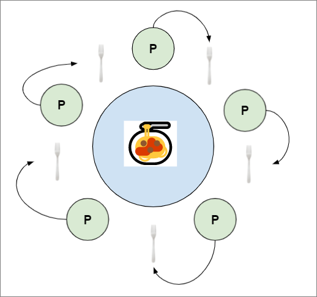
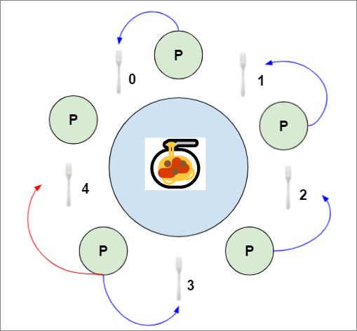
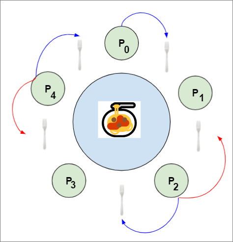

# Importance of project
1. Highlights synchronization problems that you will see when allocating resources in operating systems.

# Reading
- [Good background information for problem, mutexes, semapores, conditions](https://codecharms.me/posts/operating-system-the-dining-philosophers-problem)
- [Another good reading, but no fixed sol](https://sites.cs.ucsb.edu/~rich/class/cs170/notes/DiningPhil/index.html)

# Considerations to take not
- <ins>Deadlock</ins>
  - Each thread (i.e. philosopher) is independent from each other
  - We may first have a solution where each philosopher picks up the right fork first, and subsequently the left
  - When all of the threads pick up its right fork, there wouldn't be left forks available and hence the program would **deadlock**

# Solutions
- [Dining Philosophers problem & solutions](https://en.wikipedia.org/wiki/Dining_philosophers_problem)
1. Resource Hierarchy solution (https://medium.com/science-journal/the-dining-philosophers-problem-fded861c37ed)
	- solution proposed by `Edsger Wybe Dijkstra`
	- Philosophers will always pick up lower/higher numbered fork first. E.g. to use lower numbered fork as an example, if all philosophers attempt to pick up lowest numbered fork, highest-numbered fork will still remain, and deadlock would be avoided.
	- After picking up lowest fork, philosopher will then pick up the higher-numbered fork.
	- In visualisation below, **blue** represents first fork picked up, **red** represents second fork.

	

	- Another implementation would be to have **even** numbered (incl 0) to pick up forks from `left-to-right`, and **odd** numbered to pick forks up from `right-to-left`.

	

	- **Problems with using solution**
    	- not practical if list of **required resources is not known in advance**. For our problem, resource handling is simple as each philosopher would only require 2 forks before eating.
    	- not fair in terms of **speed**, philosophers are not guaranteed to obtain forks in order, i.e. philo2 may obtain fork before philo1. As our problem requies each philosopher to be an independent thread, where they can never communicate with one another. Ordering of obtaining forks will **always be unfair**.

2. Arbitrator
	- Introduce an arbitrator/intermediary, i.e. a waiter will supply forks to philosophers instead of each of them picking up the forks themselves.
	- Each waiter will then be represented by a **mutex** or **semaphore**

	- **Problems with using solution**
    	- Reduced parallelism, since essentially, philosophers will have to take turns requesting for forks, instead of picking the forks themselves
    	- Project requires us to represent each fork as their own individual mutex. So we are not allowed to have a central mutex lock represented by the waiter.

3. Limiting number of eating philosophers on the table
	- Last philosopher would have to wait for someone to finsih dining before accessing forks.

4. Chandy/Misra solution
	1. Fork is first given to philosopher with lowest ID
	2. When philosopher requies a fork, he will send a request to neighbouring philosophers
	3. Forks are clean before eating, after eating, they become dirty. Forks will be 'cleaned' before providing to the philospher requesting for forks.

	- **Advantages**
    	- allows for large degree of concurrency
    	- It solves the starvation problem: the clean / dirty states act as a way of giving preference to the most ‘starved’ processes.
    	- completely distributed and requires no central authority.

	- **Problems with using solution**
    	- Violates the requirement that "the philosophers do not speak to each other" (due to the request messages)

# Other considerations
- Starvation
- Fairness
- Parallelism
- Central authority
- Communication between threads

# Concepts
- Concurrency
- Parallelism
- Deadlocks
  - occurs in a concurrent program when multiple threads of execution are blocked and cannot make progress because each is waiting for a condition in order to continue that only the others can make true.
- Livelocks
- Starvation
- Finite Bypass
  - if algorithm is starvation-free it has finite bypass